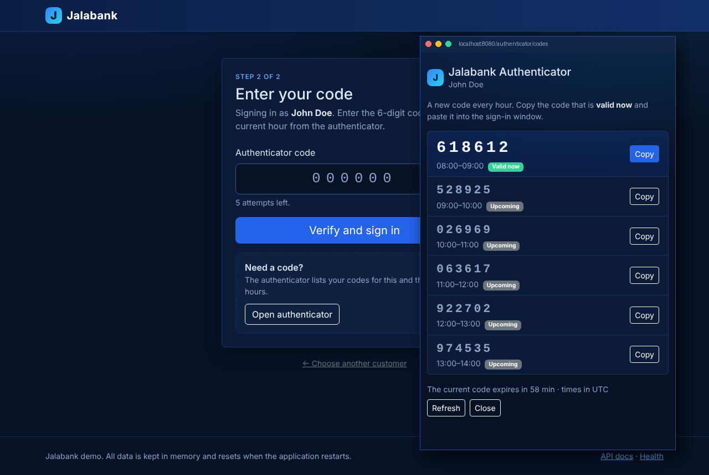

# Jalabank Demo Application

A small demo bank built with **Java 21** and **Spring Boot 4**, with a dark blue web UI. Sign in as a customer with an hourly 6-digit authenticator code, add, browse and delete your deposits and withdrawals, see the cumulative balance after each transaction, and use the same data through a REST API documented with OpenAPI at **`/docs`**.

The app needs **no database**. It starts with about six months of realistic demo data (salary, rent, groceries, card payments) kept in memory, so it runs anywhere with one command. Everything you add resets when the app restarts.

**[Overview](#overview)** · **[Signing in](#signing-in)** · **[Run locally](#run-locally)** · **[Docker](#docker)** · **[Host on Render](#host-on-render)** · **[REST API](#rest-api)** · **[Project structure](#project-structure)** · **[Screenshots](#screenshots)**

---

## Overview

| Page | What it does |
|---|---|
| **Sign in** (`/login`, `/authenticator`) | Choose a customer and enter that customer's 6-digit code for the current hour. The codes are listed in the authenticator pop-up window. See [Signing in](#signing-in). |
| **Dashboard** (`/`) | The signed-in customer's current balance, this month's income and expenses, scheduled (future-dated) transactions, and the latest transactions. |
| **Balances** (`/balances`) | The customer's transactions in a month, with the cumulative balance after each one and the month's totals. Change the month with the arrows or the filters. The list is paginated (5–1000 rows per page). Delete one transaction with its trash button, or tick several (or all on the page) and choose **Delete selected**. Both ask for confirmation first. |
| **Add transaction** (`/transaction`) | Form for a deposit or withdrawal to the signed-in customer's account, with a date and message. Amounts are validated (0.01 to 9 999 999, two decimals at most). A future date makes it a scheduled transaction. |
| **API docs** (`/docs`) | Swagger UI generated from the code. Every endpoint can be tried out in the browser. |

**Tech stack:** Java 21 · Spring Boot 4.1 (Web MVC, Thymeleaf, Validation, Security, Actuator) · springdoc-openapi (Swagger UI) · Bootstrap 5.3 dark mode with a custom navy theme (bundled, no CDN) · JUnit 5 + AssertJ · Docker.

<details>
<summary><b>How the demo data works</b></summary>

- `DemoDataSeeder` creates two customers, John Doe and Jane Doe, each with their own transactions (salary, rent, groceries, bills) from the start of the month six months ago up to today, so the current month always has data.
- The generator uses a fixed random seed, so the amounts are the same on every start.
- Data lives in in-memory repositories (`CustomerRepository`, `TransactionRepository`). There is no database, and nothing is written to disk.
- To keep a public demo from growing without limit, the app accepts at most 10 000 transactions. Delete some, or restart the app to reset.

</details>

<details>
<summary><b>How the balances are calculated</b></summary>

All amounts are `BigDecimal`, so there are no floating-point rounding errors. `TransactionService` does the calculations, and every balance belongs to **one customer**: another customer's transactions never change it.

- **Cumulative balance:** a running total over the customer's transactions in booking order: by date, and in the order they were added within the same date.
- **Current balance:** the customer's balance today. Transactions dated in the future are not counted yet; the dashboard shows them as *scheduled*.
- **Month-end balance:** the customer's balance after the last transaction on or before the last day of the month.
- **Income / expenses:** the sum of the month's deposits and of its withdrawals.

The tests recompute every cumulative balance independently to check this.

</details>

---

## Signing in

Every page and the REST API need a signed-in customer. Signing in has two steps:

1. **Choose a customer.** On `/login`, pick **John Doe** or **Jane Doe** from the list and choose **Log in**. There are no passwords in the demo.
2. **Enter the authenticator code.** On `/authenticator`, choose **Open authenticator**. A pop-up window lists the customer's code for the current hour (marked **Valid now**) and for the next five hours. Choose **Copy** next to the current code, paste it into the code field and choose **Verify and sign in**.

To switch customers, choose **Sign out** in the top bar and sign in again. While signed in, you only see and change your own transactions.

<details>
<summary><b>How the authenticator works</b></summary>

- `AuthenticatorService` gives each customer a random 6-digit code for each clock hour (from `SecureRandom`). The codes are created when first needed and kept in memory, so they change when the app restarts. Codes from before the previous hour are forgotten.
- A code is valid during its own hour and for the first two minutes of the next one, so a code copied at 13:59 still works when you submit it at 14:00.
- After 5 wrong codes, sign-in starts over from choosing the customer.
- The customer is signed in only after the right code. Until then, every page except the sign-in pages redirects to `/login`, and the API answers `401`. After the right code, the session gets a new id.
- Times in the authenticator are in the server's time zone, usually UTC on hosting services.
- This is a demo of the sign-in flow, not real security: anyone who opens the app can choose a customer and read that customer's codes in the authenticator window. It has no Google or Microsoft Authenticator or other external service.

</details>

---

## Run locally

**Requirements:** Java 21 or newer. Maven is optional, because the project includes the Maven wrapper.

```bash
git clone https://github.com/jussipalanen/jalabank-spring-boot.git
cd jalabank-spring-boot/release
./mvnw spring-boot:run
```

Open <http://localhost:8080>.

<details>
<summary><b>More commands</b></summary>

| Task | Command (in `release/`) |
|---|---|
| Run the tests | `./mvnw test` |
| Build a runnable jar | `./mvnw package`, which creates `target/jalabank.jar` |
| Run the jar | `java -jar target/jalabank.jar` |
| Use another port | `PORT=9090 java -jar target/jalabank.jar` |
| Health check | `curl http://localhost:8080/api/health` (or `/actuator/health`) |
| API docs | <http://localhost:8080/docs> |

On Windows, use `mvnw.cmd` instead of `./mvnw`.

</details>

---

## Docker

**Requirements:** [Docker Desktop](https://docs.docker.com/get-docker/) or Docker Engine with the Compose plugin. On Windows, enable the WSL 2 integration.

From the project root, use the `dev` helper script:

```bash
cd jalabank-spring-boot
./dev up        # build, start in the background and wait until it's ready
./dev logs      # follow the logs (Ctrl+C stops following, the app keeps running)
./dev down      # stop
```

Open <http://localhost:8080>. Run `./dev help` to list all commands.

<details>
<summary><b>All <code>dev</code> commands</b></summary>

| Command | What it does |
|---|---|
| `./dev up` (or `start`) | Build if needed, start in the background, and wait until the app is healthy |
| `./dev up -f` (or `fg`) | Start in the foreground with logs; `Ctrl+C` stops |
| `./dev down` (or `stop`) | Stop and remove the container |
| `./dev restart` | Restart the running container (the demo data resets) |
| `./dev rebuild` | Rebuild the image from scratch, without cache, and start |
| `./dev logs` | Follow the logs; `./dev logs -n` prints them once |
| `./dev status` (or `ps`) | Show the container status |
| `./dev health` | Call the health endpoint |
| `./dev shell` (or `sh`) | Open a shell inside the running container |
| `./dev open` | Open the app in your browser |
| `./dev build` | Build the image only |
| `./dev test` | Run the Maven tests inside Docker, with no local Java needed |
| `./dev clean` | Stop the app and remove the Jalabank images |

**Another port:** `JALABANK_PORT=9090 ./dev up`

**Shorter command:** add an alias to your `~/.bashrc` or `~/.zshrc`, for example `alias dev="$HOME/projects/jalabank-spring-boot/dev"` (use your own path). Then `dev up` works from any folder.

**Windows:** run it in WSL or Git Bash.

</details>

<details>
<summary><b>Plain Docker Compose and Docker</b></summary>

`dev` runs the same thing as these commands:

```bash
cd jalabank-spring-boot/release
docker compose up --build     # Ctrl+C stops
docker compose down
```

Without Compose:

```bash
docker build -t jalabank-demo .
docker run --rm -p 8080:8080 jalabank-demo
```

The old `release/toolbox` script (`start`, `build`, `stop`) still works and now calls `dev`.

The image is a two-stage build. The first stage runs the tests and builds the jar with Maven, and the second runs it on a slim Java 21 runtime as a non-root user. Java's memory is capped at 75 % of the container's limit, so the app also fits small 512 MB hosting plans.

</details>

---

## Host on Render

[Render](https://render.com) runs the app straight from this repository using the `Dockerfile`. No database is needed, so you only create **one web service**.

### Option A: Blueprint (one click)

The repository has a `render.yaml` blueprint at its root.

1. Push the code to GitHub. Render deploys from the branch you choose, usually `main`.
2. In the Render dashboard, choose **New → Blueprint**.
3. Connect your GitHub account if you haven't already, and pick the `jalabank-spring-boot` repository.
4. Render reads `render.yaml` and shows one web service named **jalabank**. Choose **Apply**.
5. The first build takes a few minutes. When it finishes, open the `https://jalabank-xxxx.onrender.com` URL shown on the service page.

### Option B: Set it up by hand

1. In the Render dashboard, choose **New → Web Service** and pick the repository.
2. Fill in:

   | Setting | Value |
   |---|---|
   | Language / Runtime | **Docker** |
   | Branch | `main` |
   | Root Directory | `release` |
   | Dockerfile Path | `./Dockerfile` (relative to the root directory) |
   | Instance Type | **Free** works for the demo |

3. Under **Advanced**, set **Health Check Path** to `/actuator/health`.
4. Choose **Create Web Service**.

No environment variables are needed. Render tells the app which port to use through the `PORT` variable, and the app reads it (`server.port=${PORT:8080}`).

<details>
<summary><b>Good to know about Render</b></summary>

- **Auto-deploy:** each push to the deployed branch rebuilds and redeploys the app. With the blueprint, only changes under `release/` trigger a build.
- **Free instances sleep** after about 15 minutes without traffic. The first visit after that wakes the service, which can take up to about a minute. The app itself starts in a few seconds.
- **Data resets** whenever the service restarts, redeploys or wakes from sleep, because the demo data lives in memory. That is intended for a demo.
- **Memory:** free instances have 512 MB. The app uses about 150–250 MB.
- **Custom domain:** add it under the service's **Settings → Custom Domains**.
- **Logs:** the service's **Logs** tab shows the application output. Look for `Started ReleaseApplication`.
- Render's plans and limits change from time to time, so check [render.com/pricing](https://render.com/pricing) for the current ones.

</details>

---

## REST API

**Interactive docs:** open **`/docs`** (for example <http://localhost:8080/docs>). It's Swagger UI, generated by [springdoc-openapi](https://springdoc.org) from the controllers, so it always matches the code. Pick an endpoint, fill in the parameters and choose **Execute** to send a real request. The raw OpenAPI 3.1 description is at `/v3/api-docs`, for importing into Postman or a client generator.

Errors are returned as JSON [problem details](https://www.rfc-editor.org/rfc/rfc9457) with `status`, `title` and `detail`.

**Sign in first.** The `/api/v1` endpoints need a signed-in customer and work only on that customer's own transactions. In the browser, [sign in](#signing-in) and then open `/docs` in the same browser: **Execute** sends your session cookie along. Without a session the API answers `401 Unauthorized`. Another customer's transactions are reported as `404 Not Found`, and a `customerId` other than your own gives `403 Forbidden`. `/api/health` and `/actuator/health` stay public.

| Method | Endpoint | Description |
|---|---|---|
| `GET` | `/api/v1/transactions` | One page of your transactions (sorted) |
| `GET` | `/api/v1/transactions/{id}` | One of your transactions, or `404` |
| `GET` | `/api/v1/transactions/count` | Number of your transactions |
| `POST` | `/api/v1/transactions` | Add a transaction (`201` with a `Location` header) |
| `DELETE` | `/api/v1/transactions/{id}` | Delete one transaction (`204`, or `404`) |
| `DELETE` | `/api/v1/transactions?ids=…&ids=…` | Delete several; reports how many were deleted and which ids were not found |
| `GET` | `/api/v1/customers/me` | The signed-in customer |
| `GET` | `/api/v1/customers` | One page of customers |
| `GET` | `/api/v1/customers/{id}` | One customer, or `404` |
| `GET` | `/api/health` | Health status, application name and version, uptime and transaction count; `503` when unhealthy |
| `GET` | `/actuator/health` | Spring Boot's own health check (used by Docker and Render) |

<details>
<summary><b>Pagination and sorting</b></summary>

List endpoints return one page at a time:

| Parameter | Values | Default |
|---|---|---|
| `page` | `1`, `2`, … (one-based) | `1` |
| `size` | `1`–`1000` | `20` |
| `customerId` | your own customer id (transactions only; any other id gives `403`) | you |
| `sortBy` | `date`, `amount`, `id` (transactions only) | `date` |
| `sortDirection` | `DESC`, `ASC`, any case (transactions only) | `DESC` |

An unknown `sortBy` or `sortDirection` returns `400 Bad Request`.

```bash
curl -b "JSESSIONID=<your session id>" "http://localhost:8080/api/v1/transactions?page=1&size=2"
```

```json
{
  "content": [
    { "id": "3f1c2b9e-8d4a-4c1e-9b7f-2a6d5e4c3b21", "customerId": 1, "date": "2026-10-03", "amount": -46.91, "message": "Card payment" },
    { "id": "7a0e9d8c-1b2a-4c3d-8e4f-5a6b7c8d9e0f", "customerId": 1, "date": "2026-10-03", "amount": -103.72, "message": "Groceries" }
  ],
  "page": 1,
  "size": 2,
  "totalElements": 65,
  "totalPages": 33
}
```

</details>

<details>
<summary><b>Add and delete with curl</b></summary>

curl needs the session cookie of a signed-in browser. After signing in, copy the `JSESSIONID` cookie from the browser's developer tools (**Application → Cookies** in Chrome).

```bash
SESSION="JSESSIONID=<your session id>"

# Add a withdrawal for the signed-in customer (the date defaults to today)
curl -b "$SESSION" -X POST http://localhost:8080/api/v1/transactions \
  -H "Content-Type: application/json" \
  -d '{"amount": -12.50, "message": "Coffee"}'

# Delete one
curl -b "$SESSION" -X DELETE http://localhost:8080/api/v1/transactions/3f1c2b9e-8d4a-4c1e-9b7f-2a6d5e4c3b21

# Delete several
curl -b "$SESSION" -X DELETE "http://localhost:8080/api/v1/transactions?ids=<id1>&ids=<id2>"
```

</details>

<details>
<summary><b>Health check</b></summary>

```bash
curl http://localhost:8080/api/health
```

```json
{ "status": "UP", "application": "jalabank", "version": "2.2.0", "uptimeSeconds": 3600, "transactions": 107, "time": "2026-10-07T21:30:00Z" }
```

`/api/health` takes its status from the actuator's `/actuator/health`. Both appear in `/docs`.

</details>

---

## Project structure

<details>
<summary><b>Files and packages</b></summary>

```
dev                              Docker helper script (./dev help)
render.yaml                      Render blueprint
release/
├── Dockerfile                   two-stage image build
├── docker-compose.yml           local Docker run
├── toolbox                      old helper script, calls ../dev
├── pom.xml
└── src/
    ├── main/java/jussinet/jalabank/release/
    │   ├── ReleaseApplication.java      entry point
    │   ├── api/                         REST API, health check and OpenAPI settings
    │   ├── controller/                  web pages and sign-in
    │   ├── model/                       records: Customer, Transaction, StatementRow, ApiPage, …
    │   ├── repository/                  in-memory stores
    │   ├── security/                    access rules and the hourly authenticator codes
    │   ├── service/                     balance calculations and demo data
    │   └── web/                         form object, money formatting and the signed-in customer
    ├── main/resources/
    │   ├── application.properties
    │   ├── static/                      theme (css/app.css) and page script (js/app.js)
    │   └── templates/                   Thymeleaf pages
    └── test/                            unit and web tests
```

</details>

<details>
<summary><b>Ideas for later</b></summary>

- User registration and passwords
- Confirming transactions with the authenticator code
- Search and category filters on the transaction view
- An optional real database (for example PostgreSQL) behind the same repositories

</details>

---

## Screenshots

<details open>
<summary><b>Sign in: enter the authenticator code, with the code list in a pop-up window</b></summary>



</details>

<details open>
<summary><b>Balances: monthly transactions with cumulative balances, selection and pagination</b></summary>


</details>

<details>
<summary><b>Add transaction</b></summary>


</details>

<details>
<summary><b>Dashboard</b></summary>


</details>

<details>
<summary><b>API docs (Swagger UI at /docs)</b></summary>


</details>
