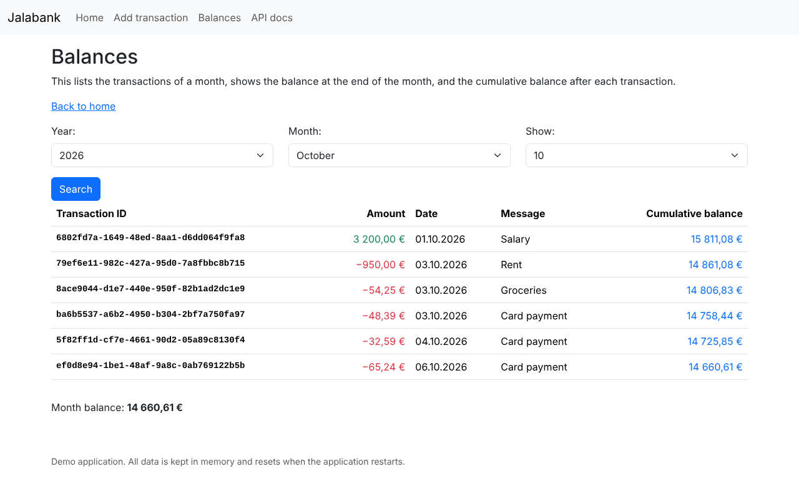
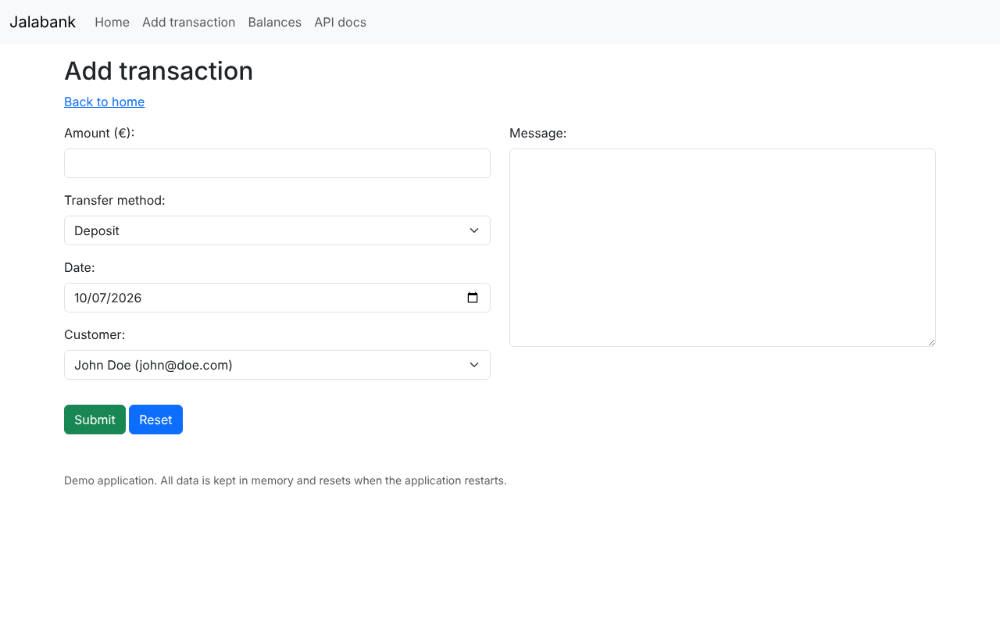
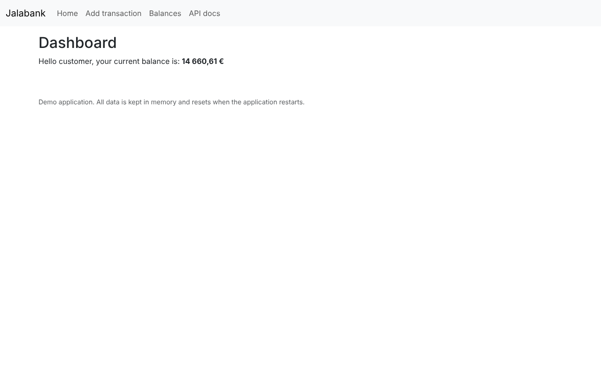
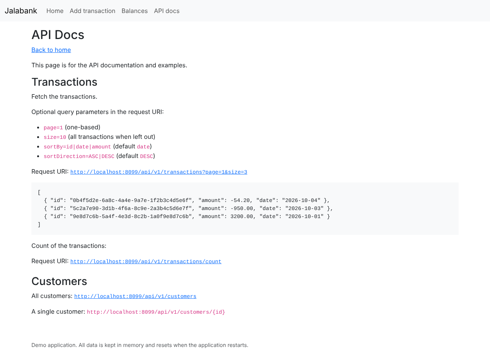

# Jalabank Demo Application

A small demo bank built with **Java 21** and **Spring Boot 4**. Add deposits and withdrawals, browse the transactions of a month with the cumulative balance after each one, and read the transactions through a REST API.

The app needs **no database**. It starts with about six months of realistic demo data (salary, rent, groceries, card payments) kept in memory, so it runs anywhere with one command. Everything you add resets when the app restarts.

**[Overview](#overview)** · **[Run locally](#run-locally)** · **[Docker](#docker)** · **[Host on Render](#host-on-render)** · **[REST API](#rest-api)** · **[Project structure](#project-structure)** · **[Screenshots](#screenshots)**

---

## Overview

| Page | What it does |
|---|---|
| **Home** | Shows the customer's current balance. |
| **Add transaction** | Form for a deposit or withdrawal, with a date, customer and message. Amounts are validated (0.01 to 9 999 999, two decimals at most). |
| **Balances** | Transactions of the chosen month and year, with the cumulative balance after each one, the balance at the end of the month, and pagination. |
| **API docs** | The REST API endpoints with live example links. |

**Tech stack:** Java 21 · Spring Boot 4.1 (Web MVC, Thymeleaf, Validation, Actuator) · Bootstrap 5.3 (bundled, no CDN) · JUnit 5 + AssertJ · Docker.

<details>
<summary><b>How the demo data works</b></summary>

- `DemoDataSeeder` creates two customers (John Doe and Jane Doe) and generates transactions from the start of the month six months ago up to today, so the current month always has data.
- The generator uses a fixed random seed, so the amounts are the same on every start.
- Data lives in in-memory repositories (`CustomerRepository`, `TransactionRepository`). There is no database, and nothing is written to disk.
- To keep a public demo from growing without limit, the app accepts at most 10 000 transactions. Restart it to reset.

</details>

<details>
<summary><b>How the balances are calculated</b></summary>

All amounts are `BigDecimal`, so there are no floating-point rounding errors. `TransactionService` does the calculations:

- **Current balance:** the sum of all transactions.
- **Cumulative balance:** a running total over all transactions in date order. Transactions on the same date keep the order they were added in.
- **Month balance:** the cumulative balance after the last transaction on or before the last day of the month.

</details>

---

## Run locally

**Requirements:** Java 21 or newer. Maven is optional, because the project includes the Maven wrapper.

```bash
git clone https://github.com/jussipalanen/jalabank-java-spring-boot.git
cd jalabank-java-spring-boot/release
./mvnw spring-boot:run
```

Open <http://localhost:8080>.

<details>
<summary><b>More commands</b></summary>

| Task | Command (in `release/`) |
|---|---|
| Run the tests | `./mvnw test` |
| Build a runnable jar | `./mvnw package`, which creates `target/jalabank.jar` |
| Run the jar | `java -jar target/jalabank.jar` |
| Use another port | `PORT=9090 java -jar target/jalabank.jar` |
| Health check | `curl http://localhost:8080/actuator/health` |

On Windows, use `mvnw.cmd` instead of `./mvnw`.

</details>

---

## Docker

**Requirements:** [Docker Desktop](https://docs.docker.com/get-docker/) or Docker Engine with the Compose plugin. On Windows, enable the WSL 2 integration.

```bash
cd jalabank-java-spring-boot/release
docker compose up --build
```

Open <http://localhost:8080>. Stop with `Ctrl+C`, or with `docker compose down`.

<details>
<summary><b>Toolbox script and plain Docker</b></summary>

The `toolbox` script wraps the Compose commands:

```bash
sh toolbox start   # build and start
sh toolbox build   # rebuild from scratch, without cache, and start
sh toolbox stop    # stop and remove the container
```

Without Compose:

```bash
docker build -t jalabank-demo .
docker run --rm -p 8080:8080 jalabank-demo
```

The image is a two-stage build. The first stage runs the tests and builds the jar with Maven, and the second runs it on a slim Java 21 runtime as a non-root user. Java's memory is capped at 75 % of the container's limit, so the app also fits small 512 MB hosting plans.

</details>

---

## Host on Render

[Render](https://render.com) runs the app straight from this repository using the `Dockerfile`. No database is needed, so you only create **one web service**.

### Option A: Blueprint (one click)

The repository has a `render.yaml` blueprint at its root.

1. Push the code to GitHub. Render deploys from the branch you choose, usually `main`.
2. In the Render dashboard, choose **New → Blueprint**.
3. Connect your GitHub account if you haven't already, and pick the `jalabank-java-spring-boot` repository.
4. Render reads `render.yaml` and shows one web service named **jalabank**. Choose **Apply**.
5. The first build takes a few minutes. When it finishes, open the `https://jalabank-xxxx.onrender.com` URL shown on the service page.

### Option B: Set it up by hand

1. In the Render dashboard, choose **New → Web Service** and pick the repository.
2. Fill in:

   | Setting | Value |
   |---|---|
   | Language / Runtime | **Docker** |
   | Branch | `main` |
   | Root Directory | `release` |
   | Dockerfile Path | `./Dockerfile` (relative to the root directory) |
   | Instance Type | **Free** works for the demo |

3. Under **Advanced**, set **Health Check Path** to `/actuator/health`.
4. Choose **Create Web Service**.

No environment variables are needed. Render tells the app which port to use through the `PORT` variable, and the app reads it (`server.port=${PORT:8080}`).

<details>
<summary><b>Good to know about Render</b></summary>

- **Auto-deploy:** each push to the deployed branch rebuilds and redeploys the app. With the blueprint, only changes under `release/` trigger a build.
- **Free instances sleep** after about 15 minutes without traffic. The first visit after that wakes the service, which can take up to about a minute. The app itself starts in a few seconds.
- **Data resets** whenever the service restarts, redeploys or wakes from sleep, because the demo data lives in memory. That is intended for a demo.
- **Memory:** free instances have 512 MB. The app uses about 150–250 MB.
- **Custom domain:** add it under the service's **Settings → Custom Domains**.
- **Logs:** the service's **Logs** tab shows the application output. Look for `Started ReleaseApplication`.
- Render's plans and limits change from time to time, so check [render.com/pricing](https://render.com/pricing) for the current ones.

</details>

---

## REST API

Base URL: `http://localhost:8080/api/v1`, or your Render URL followed by `/api/v1`.

| Method | Endpoint | Description |
|---|---|---|
| `GET` | `/transactions` | The transactions, newest first by default |
| `GET` | `/transactions/count` | The number of transactions |
| `GET` | `/customers` | All customers |
| `GET` | `/customers/{id}` | One customer, or `404` if it doesn't exist |

<details>
<summary><b>Query parameters for <code>/transactions</code></b></summary>

| Parameter | Values | Default |
|---|---|---|
| `page` | `1`, `2`, … (one-based) | `1` |
| `size` | page size | all transactions |
| `sortBy` | `id`, `amount`, `date` | `date` |
| `sortDirection` | `ASC`, `DESC` (any case) | `DESC` |

An unknown `sortBy` or `sortDirection` returns `400 Bad Request`.

```bash
curl "http://localhost:8080/api/v1/transactions?page=1&size=3&sortBy=date&sortDirection=DESC"
```

```json
[
  { "id": "0b4f5d2e-6a8c-4a4e-9a7e-1f2b3c4d5e6f", "amount": -54.20, "date": "2026-10-04" },
  { "id": "5c2a7e90-3d1b-4f6a-8c9e-2a3b4c5d6e7f", "amount": -950.00, "date": "2026-10-03" },
  { "id": "9e8d7c6b-5a4f-4e3d-8c2b-1a0f9e8d7c6b", "amount": 3200.00, "date": "2026-10-01" }
]
```

</details>

---

## Project structure

<details>
<summary><b>Files and packages</b></summary>

```
render.yaml                      Render blueprint
release/
├── Dockerfile                   two-stage image build
├── docker-compose.yml           local Docker run
├── toolbox                      helper script for Docker Compose
├── pom.xml
└── src/
    ├── main/java/jussinet/jalabank/release/
    │   ├── ReleaseApplication.java      entry point
    │   ├── controller/                  web pages and REST API
    │   ├── model/                       records: Customer, Transaction, StatementRow, …
    │   ├── repository/                  in-memory stores
    │   ├── service/                     balance calculations and demo data
    │   └── web/                         form object and money formatting
    ├── main/resources/
    │   ├── application.properties
    │   └── templates/                   Thymeleaf pages
    └── test/                            unit and web tests
```

</details>

<details>
<summary><b>Ideas for later</b></summary>

- User registration and login
- Strong authentication for login and confirming transactions
- Per-customer balances and filters on the transaction view
- An optional real database (for example PostgreSQL) behind the same repositories

</details>

---

## Screenshots

<details open>
<summary><b>Balances: monthly transactions with cumulative balances</b></summary>



</details>

<details>
<summary><b>Add transaction</b></summary>



</details>

<details>
<summary><b>Home</b></summary>



</details>

<details>
<summary><b>API docs</b></summary>



</details>
